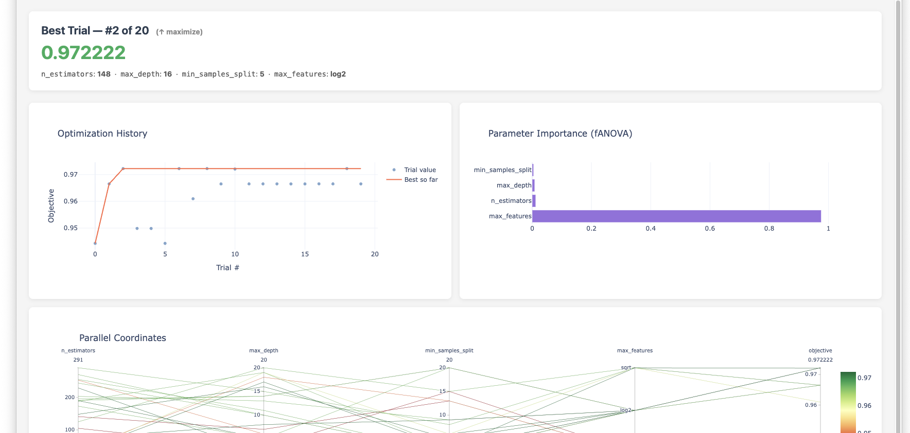
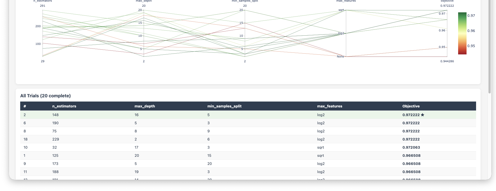
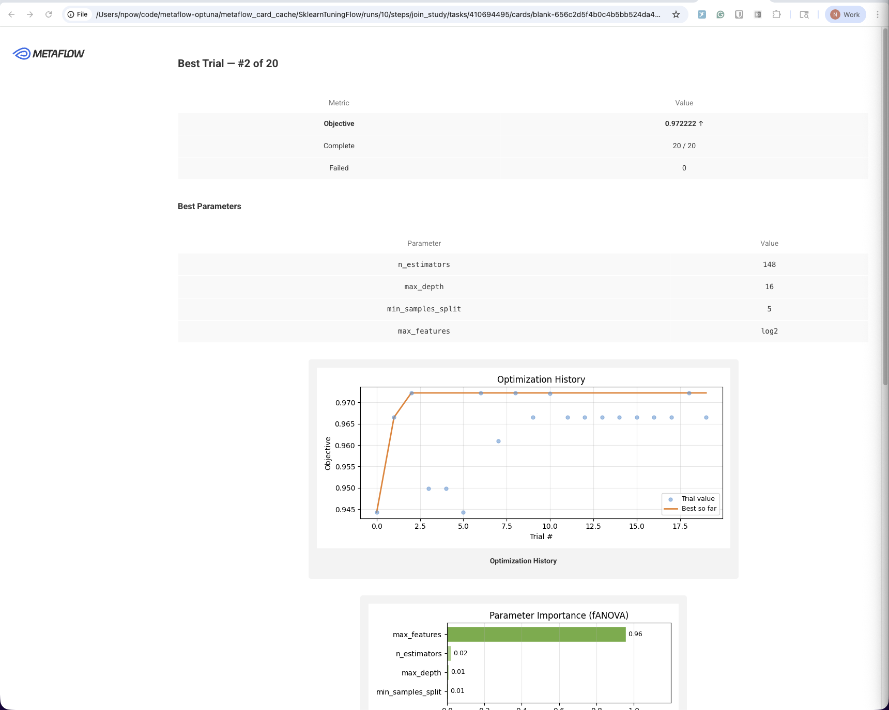
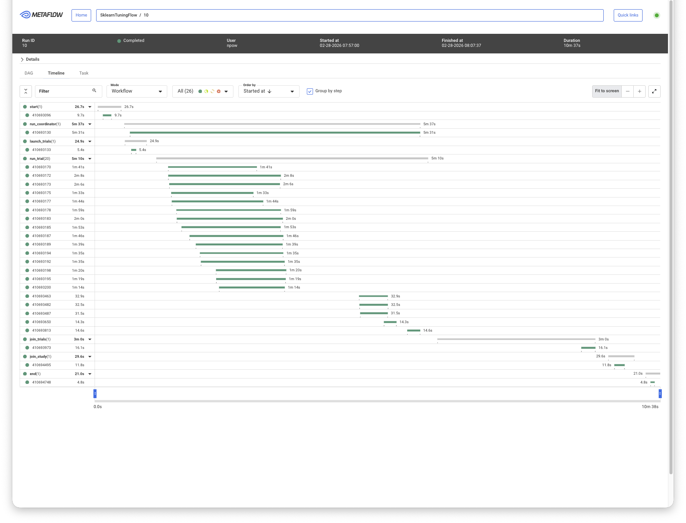

# metaflow-optuna

[](https://pypi.org/project/metaflow-optuna/)
[](https://github.com/npow/metaflow-optuna/actions/workflows/ci.yml)
[](https://pypi.org/project/metaflow-optuna/)
[](LICENSE)

Optuna hyperparameter tuning that fits naturally into Metaflow — parallel trials as native tasks, adaptive TPE that actually adapts, and results you can read without digging through logs.

---

## The problem

Running Optuna inside Metaflow works, but it's awkward. The standard approach runs all trials sequentially in a single step, which wastes your `@batch` parallelism. If you fan out with `foreach` to parallelize, you lose TPE adaptivity — all parameters have to be sampled upfront before any trial runs, so the sampler can't learn from early results. And either way, you get a wall of Optuna log spam and no easy way to see results in the Metaflow UI.

## How this fixes it

An ephemeral coordinator service runs in a parallel branch alongside your trials. Each trial task calls the coordinator over HTTP to get its parameters — so TPE sees every completed result before suggesting the next trial, even though all tasks run in parallel. No external database, no infrastructure to set up. When the last trial finishes, the coordinator exits and the study is available as a normal Metaflow artifact.

```
start
  ├── run_coordinator  (Optuna study lives here, serves suggest/tell over HTTP)
  └── launch_trials
       ├── run_trial[0]  ─ ask → suggest → tell
       ├── run_trial[1]  ─ ask → suggest → tell
       └── run_trial[N]  ─ ask → suggest → tell
            └── join_study  (study artifact + HTML report + Metaflow card)
```

---

## Installation

```bash
pip install metaflow-optuna
```

Requires: `metaflow>=2.9`, `optuna>=3.0`, `fastapi`, `uvicorn`, `httpx`, `plotly`, `matplotlib`

---

## Usage

```python
from metaflow import FlowSpec, Parameter, card, current, step
from metaflow_optuna import hyperparam, optuna_coordinator, render_study_card, render_study_html

class MyTuningFlow(FlowSpec):
    n_trials = Parameter("n_trials", default=30, type=int)

    @step
    def start(self):
        self.coordinator_id = current.run_id
        self.n_trials_int   = int(self.n_trials)
        self.next(self.run_coordinator, self.launch_trials)

    @optuna_coordinator(direction="maximize", sampler="tpe")
    @step
    def run_coordinator(self):
        self.next(self.join_study)

    @step
    def launch_trials(self):
        from metaflow_optuna.rendezvous import await_coordinator
        self.coordinator_url = await_coordinator(self.coordinator_id)
        self.trial_indices   = list(range(self.n_trials_int))
        self.next(self.run_trial, foreach="trial_indices")

    @hyperparam(objective="val_loss", direction="minimize")
    @step
    def run_trial(self):
        trial = self.trial  # injected by @hyperparam

        lr      = trial.suggest_float("lr",      1e-4, 1e-1, log=True)
        dropout = trial.suggest_float("dropout", 0.0,  0.5)
        layers  = trial.suggest_int("layers",    1,    4)

        self.val_loss = train_and_eval(lr, dropout, layers)
        self.next(self.join_trials)

    @step
    def join_trials(self, inputs):
        self.trial_results = [inp.trial_result for inp in inputs if hasattr(inp, "trial_result")]
        self.merge_artifacts(inputs, exclude=["trial", "val_loss", "trial_result"])
        self.next(self.join_study)

    @card(type="blank")
    @step
    def join_study(self, inputs):
        study = next(inp.study for inp in inputs if hasattr(inp, "study"))
        self.study      = study
        self.study_html = render_study_html(study)
        render_study_card(study)
        self.next(self.end)

    @step
    def end(self):
        print("Best:", self.study.best_params, "→", self.study.best_value)

if __name__ == "__main__":
    MyTuningFlow()
```

```bash
python flow.py run --n_trials 50
```

---

## Results

### Interactive HTML report (`self.study_html`)





### Metaflow card



### Run timeline



---

## Batch mode (no coordinator, pre-sampled)

If you don't need adaptive sampling — e.g. you're doing a grid sweep or want fully reproducible parallel trials — you can skip the coordinator entirely. Parameters are sampled upfront with QMC and replayed in each task.

```python
from metaflow_optuna import create_study_inputs, rebuild_study, hyperparam

class BatchFlow(FlowSpec):
    @step
    def start(self):
        self.configs = create_study_inputs(search_space, n_trials=50)
        self.next(self.train, foreach="configs")

    @hyperparam(objective="val_loss", mode="batch")
    @step
    def train(self):
        trial = self.trial
        lr    = trial.suggest_float("lr", 1e-4, 1e-1, log=True)
        ...
        self.val_loss = ...
        self.next(self.join)

    @step
    def join(self, inputs):
        self.study = rebuild_study(inputs, objective="val_loss", direction="minimize")
        self.next(self.end)
```

---

## Crash handling

If a trial throws an exception, `@hyperparam` catches it, marks the trial as failed, and lets the run continue — so one bad trial doesn't kill 49 others. If a task is hard-killed (OOM, SIGKILL), the coordinator waits up to the timeout and returns a partial study. Metaflow `resume` restarts failed tasks and the coordinator picks up where it left off.

---

## API reference

```python
@optuna_coordinator(
    direction="minimize",   # or "maximize"
    sampler="tpe",          # "tpe" | "random" | "cmaes" | "qmc"
    port=None,              # auto-assign if None
    timeout=7200,           # seconds to wait for all trials
)

@hyperparam(
    objective="val_loss",   # name of the self.<attr> you set in the step body
    direction="minimize",
    suppress_logs=True,     # silences optuna INFO spam
    mode="adaptive",        # "adaptive" (coordinator) | "batch" (pre-sampled)
)

render_study_card(study)    # renders into current @card(type="blank") step
render_study_html(study)    # returns self-contained HTML string
```

---

## Example

[`examples/sklearn_tuning.py`](examples/sklearn_tuning.py) — tunes a `RandomForestClassifier` on the Wine dataset, 20 trials, adaptive TPE.

```bash
python examples/sklearn_tuning.py run --n_trials 20
```

## License

Apache 2.0 — see [LICENSE](LICENSE).
